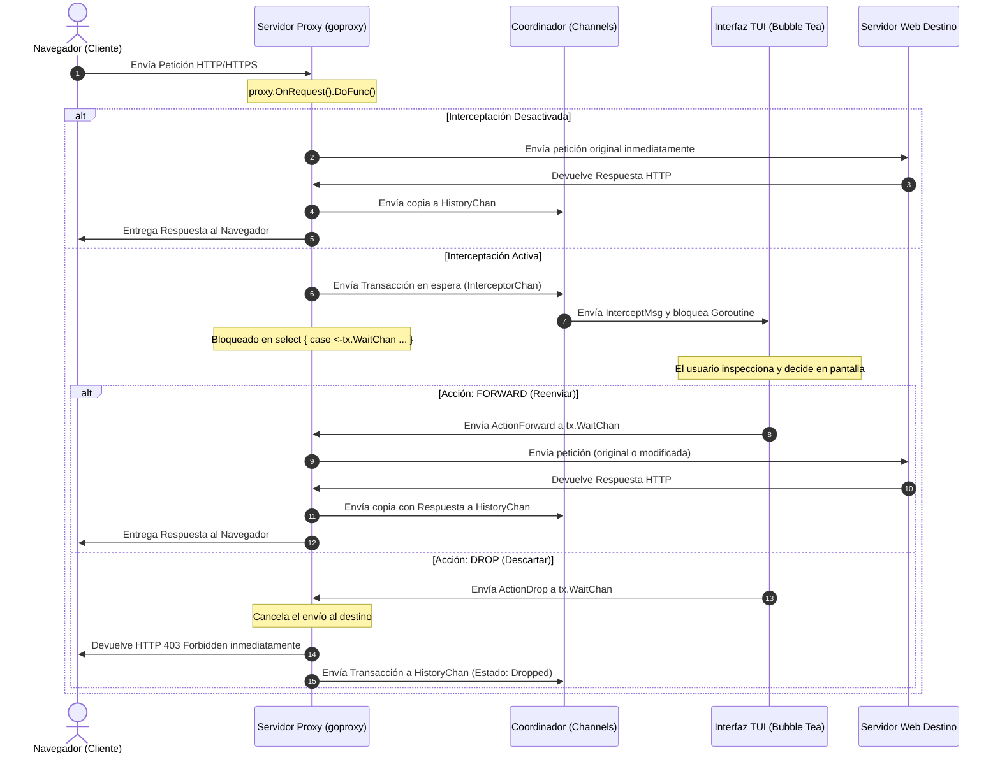

# Documentación de Arquitectura y Lógica de SpyDex v0.1.8
*El Proxy Interceptor Interactivo de Seguridad en la Terminal*

SpyDex es una herramienta CLI interactiva de interceptación, análisis y auditoría de tráfico web (HTTP/HTTPS) escrita en Go. Este documento detalla el comportamiento operativo de su proxy, los flujos internos de control y cómo utilizar cada módulo de forma efectiva.

---

## 1. Lógica Interna de Interceptación y Flujo de Control

El núcleo del programa es el servidor proxy interceptor. Funciona deteniendo de manera controlada el flujo de la petición del cliente y cediendo el control a la interfaz de usuario antes de que la petición sea enviada al servidor de destino.



### 1.1. Mecanismo de Bloqueo de Hilo
Cuando el proxy recibe una petición y la interceptación está activa, la goroutine de esa petición se detiene mediante un canal de sincronización `WaitChan` integrado en el objeto de la transacción:

```go
// En proxy.go:
// Bloquear la petición del cliente hasta que la TUI tome una decisión
var action coordinator.Action
select {
case action = <-tx.WaitChan:
case <-ctx.Done():
    action = coordinator.Action{Type: coordinator.ActionForward, ModifiedTx: tx}
}
```

El canal tiene un buffer de tamaño 1. Esto permite que el hilo del proxy espere indefinidamente sin consumir recursos de procesador hasta que el usuario pulse la tecla para enviar (`F`) o descartar (`D`), momento en el cual la TUI escribe la acción en el canal para reanudar el flujo.

### 1.2. Interceptación y Modificación de Cabeceras
Si el usuario pulsa `e` para editar la petición interceptada, la TUI parsea la entrada modificada usando la biblioteca `bufio`. Se recalculan dinámicamente el tamaño de la petición (`Content-Length`) y los punteros del cuerpo (`req.Body`) para evitar que la petición llegue corrupta al servidor de destino.

---

## 2. Flujo y Lógica de Uso por Módulos

La interfaz se estructura en pestañas dedicadas a tareas específicas del analista de seguridad:

### 2.1. Intercept (Pestaña 1)
Permite inspeccionar peticiones en tránsito cuando el botón de interceptación general está encendido (`[INTERCEPT ON]`).
*   **Inspección Activa:** Las peticiones entrantes se listan a la izquierda. Seleccionar una permite ver su estructura cruda a la derecha.
*   **Edición y Modificación:** Al entrar en modo de edición (`Enter`), el operador puede cambiar cualquier cabecera, método, endpoint o parámetro del cuerpo antes de pulsar `F` (Forward) para enviarlo.
*   **Descarte Seguro:** Si se detecta tráfico irrelevante o malicioso, el operador puede abortarlo instantáneamente con `D` (Drop), enviando un código 403 de vuelta al navegador.

### 2.2. History & Sitemap (Pestaña 2)
Es el almacén central de análisis pasivo y estructuración del objetivo:
*   **Historial de Navegación:** Lista cronológica de todas las transacciones procesadas (método, host, ruta, código HTTP de respuesta y duración).
*   **Generador Dinámico de Sitemap:** A medida que el tráfico fluye, SpyDex analiza los hosts y rutas estructurándolos en un árbol jerárquico interactivo (a la izquierda inferior). Al navegar por el árbol, se filtran las peticiones para aislar directorios concretos.
*   **Reutilización de Tráfico:** Pulsando `R` sobre cualquier petición del historial, esta se copia de inmediato en el área de edición del **Repeater**. Pulsando `A`, se envía al **Automator**.

### 2.3. Repeater (Pestaña 3)
Permite realizar pruebas manuales repetitivas modificando una petición base y observando la respuesta directamente.
*   **Multi-slotting:** Admite hasta 3 espacios de trabajo aislados (slots) para comparar diferentes pruebas en paralelo.
*   **Ejecución Rápida:** Al pulsar `R` (Run), SpyDex genera un cliente HTTP efímero en segundo plano, envía la petición cruda tal y como está descrita en la ventana de texto y actualiza el panel derecho con la respuesta exacta obtenida del servidor.

### 2.4. Decoder (Pestaña 4)
Una caja de herramientas integrada para decodificar datos sobre la marcha sin salir de la sesión de terminal.
*   **Codificación Bidireccional:** Codifica o decodifica de manera reactiva y simultánea la cadena de entrada en formatos comunes: Base64, URL Encode y representación Hexadecimal.

### 2.5. Automator (Pestaña 5)
El módulo de auditorías y pruebas automatizadas:
*   **Análisis Pasivo:** Escanea el cuerpo de la transacción importada buscando fugas involuntarias de secretos (como claves privadas SSL/SSH, tokens JWT expuestos, credenciales de AWS o webhooks de Slack).
*   **Análisis Activo (Fuzzer):**
    *   *Vulnerability Scan:* Inyecta payloads de prueba en cada parámetro HTTP (GET/POST) detectado para identificar activamente fallos de inyección SQL (SQLi), Cross-Site Scripting reflejado (XSS) y Path Traversal (LFI).
    *   *Path Discovery:* Realiza fuerza bruta sobre el host utilizando un listado de rutas sensibles comunes (`/admin`, `/.env`, `/backup.zip`, etc.) y reportando códigos de estado no tradicionales (200, 403, 500).

---

## 3. Persistencia y Carga Inteligente de Datos (Lazy Loading)

Para que el programa no consuma RAM de forma lineal con el uso, implementa un diseño de almacenamiento optimizado:

1.  **Carga Diferida (Lazy Loading):** Al iniciar SpyDex, lee de SQLite (`history.db`) solo los campos ligeros de las transacciones históricas para poblar las tablas visuales. Los cuerpos de la petición y de la respuesta (`request_body` / `response_body`), que pueden ocupar varios megabytes, permanecen en disco y se recuperan mediante `GetBodies(id)` únicamente cuando el usuario enfoca esa petición en la pantalla.
2.  **Base de Datos No Bloqueante:** SQLite se configura en modo **WAL (Write-Ahead Logging)**, lo que permite que el hilo del proxy escriba nuevas peticiones capturadas de la red de manera asíncrona mientras el usuario consulta o borra registros en la TUI sin generar colisiones ni bloqueos.

---

## 4. Generación y Carga de CA para MITM (Man-in-the-Middle)

Para interceptar tráfico cifrado TLS (HTTPS), SpyDex arranca un pipeline criptográfico interno:
1.  Busca los archivos de claves de la CA (`ca.pem` y `ca.key`). Si no existen, los genera en memoria utilizando claves RSA de 2048 bits con validez para 10 años y los guarda localmente.
2.  Cuando el navegador del cliente solicita una conexión TLS con un host externo (por ejemplo, `google.com`), el navegador envía una petición `CONNECT` al proxy.
3.  El proxy intercepta el apretón de manos TLS, genera dinámicamente un certificado SSL al vuelo para `google.com` firmado por la CA local y se lo presenta al navegador.
4.  Si el certificado de la CA local ha sido importado y marcado como de confianza en el navegador o sistema del operador, la conexión HTTPS se establece de manera transparente y SpyDex puede leer e interceptar el tráfico cifrado de forma completamente limpia.
